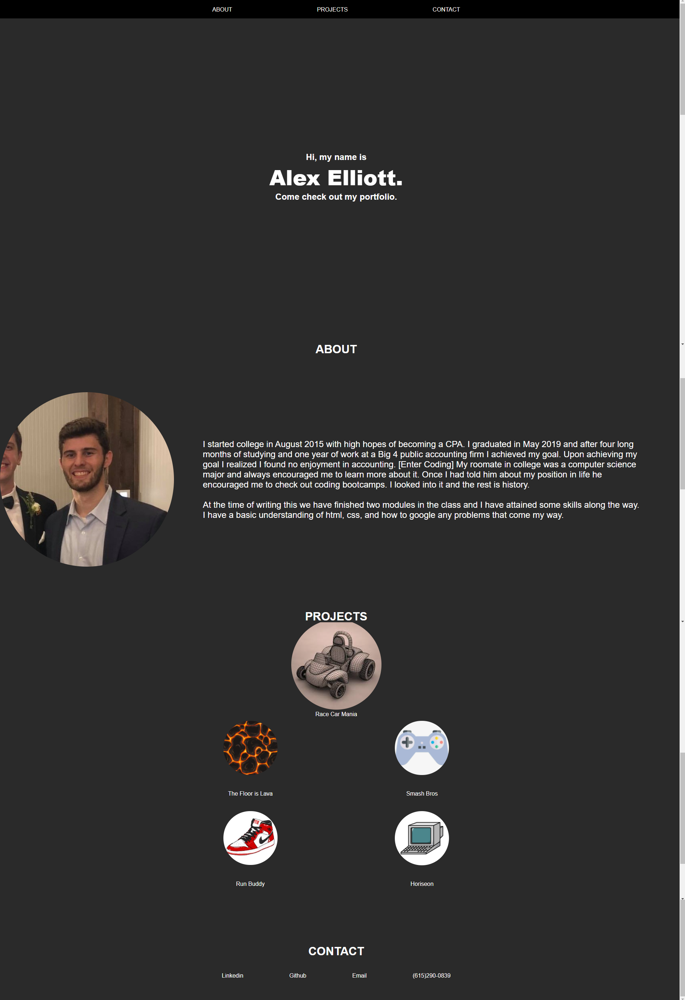

# portfolio

## Deployed Webstie link
https://alexelliott22.github.io/portfolio/

## Github page
https://github.com/alexelliott22/portfolio

## Summary
This website is my portfolio detailing my talents and abilities in programming. I wrote a few paragraphs about myself and linked to all the projects I have completed. all of the projects are placeholders until we get further into the class and I can link to work I have actually done. At the bottom I have included a contact section which future employers can use to contact me.

## Screenshot of webpage

